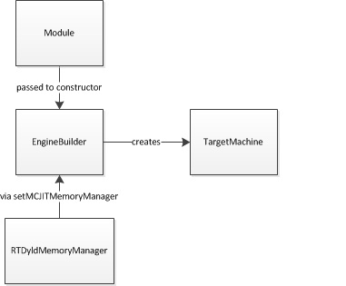
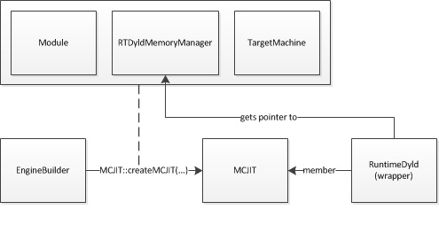
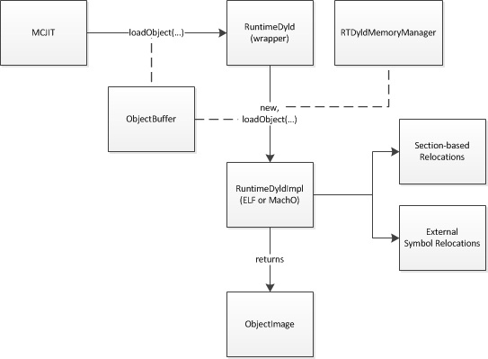

===============================
MCJIT 设计和实现
===============================

导论
============
本文档描述了MCJIT执行引擎和RuntimeDyld组件。它是实现的一个较高层的综述，
描述在代码生成和动态加载过程中的对象的动作和相互作用。

引擎的创建
===============

在一般情况下， 一个 EngineBuilder 对象是用来创建 MCJIT 执行引擎的实例的。
EngineBuilder 对象将一个 llvm::Module 对象作为其构造函数的参数。
代码可以设置多个选项用于控制创建的MCJIT 引擎，
包括选择MCJIT作为创建的JIT引擎的类型。特别需要说明的是
EngineBuilder::setMCJITMemoryManager 这个函数。
如果代码在这时候没有显式地创建一个内存管理器，
那么一个默认的内存管理器（特别是 SectionMemoryManager ) 会在MCJIT 引擎
实例化时被创建。

一旦这些选项被设置，代码会调用 EngineBuilder::create 去床架一个MCJIT
引擎的实例。如果代码调用的是没有包含 TargetMachine 作为参数的版本，
那么按照当前llvm::Module 相关的target triple, 一个新的TargetMachine 对象会被创建
用于建立这个 EngineBuilder 对象。

EngineBuilder::create 会调用静态的 MCJIT::createJIT 函数，
然后传递它的指针到 llvm::Module 对象、内存管理器、和 TargetMachine
对象，这些对象都会被 MCJIT 对象拥有。

MCJIT 类有一个 Dyld 成员变量, 它包含了一个RuntimeDyld
的封装类的实例。这个成员对象会在 MCJIT 和 RuntimeDyldImpl
对象交流时候被实用，而后者会在 这个对象被加载时候自动创建。

在创建时， MCJIT 包含了一个从EngineBuilder 中获得的、指向 Module
对象的指针，但是它并未用这个module 直接生成代码。 代码生成的工作被滞后了，直到
MCJIT::finalizeObject 方法被显式的调用或者 一个需要代码生成工作的函数
例如 MCJIT::getPointerToFunction 的函数被调用。

代码生成
===============

当代码生成被触发的时候，如上文藐视，MCJIT会首先尝试从 它的ObjectCache
成员对象中获取一个 对象镜像
如果有的话。如果一个缓存的对象镜像不能被获取到，那么MCJIT 会调用 emitObject
方法。 MCJIT::emitObject 会用一个本地的 PassManager 实例 并创建 一个
ObjectBufferStream 的实例，两者都会在调用 PassManager::run 作用Module 对象 之前
传递给 TargetMachine::addPassesToEmitMC 方法。
。

.. image:: MCJIT-load.png

PassManager::run 调用会导致MC代码生成机制
从而生成一个完整的可重定位的二进制目标镜像 （可能是ELF或者MachO 取决于Target）
进入 ObjectBufferStream 对象中，后者会被flush 以完成整个过程。如果 ObjectCache
被使用， 那么镜像会被传递给ObjectCache 对象中。

在这一点上， ObjectBufferStream 会包含整个原始的目标镜像。
当代码被执行之前，来自这个镜像的代码和数据段必须被载入适当的内存中，
重定向必须被应用、内存权限和代码缓存无效化（如果需要的话）必须被完成。

目标加载
==============

当一个目标镜像被获得，那么无论是从代码生成或者从 ObjectCache
缓存中获取，它都会传递给RuntimeDyld 然后被加载。 RuntimeDyld
封装类会检查这个对象 确定它的文件格式并根据这个类型创建 RuntimeDyldELF 或者
RuntimeDyldMachO 实例（两种都是RuntimeDyldImpl 的衍生类） 并且调用
RuntimeDyldImpl::loadObject 方法去完整实际的加载工作。

RuntimeDyldImpl::loadObject 开始时会从ObjectBuffer 中创建一个ObjectImage 实例。
ObjectImage 封装了类ObjectFile
，是一个负责将二进制的目标镜像解析并提供其中格式相关的头部信息 包括
段、符号、和重定向信息 的辅助类。

RuntimeDyldImpl::loadObject 会遍历镜像中的符号信息。
包含常见的符号的信息会被收集以做日后使用。
对于每一个函数或者数据符号，相关的段会被加载进内存，
然后符号会被保存在一个符号表的数据结构中。
当遍历完成时候，一个段用于常见符号的段会被触发。

下一步， RuntimeDyldImpl::loadObject
会遍历目标镜像中的各个段，然后会在每个段中遍历这些段里的重定向信息。对于每一个重定向，它会调用
processRelocationRef
方法，用于检查重定向信息和保存之于两个中的一个数据结构中，一个基于段的的重定位列表map
和一个外部符号的重定位map。

.. image:: MCJIT-load-object.png

当 RuntimeDyldImpl::loadObject 返回时，这个目标的所有的代码、数据、段
都会被载入被内存管理器分配的内存中，重定位信息会被装备好，
但是重定位信息并没有被应用，生成的代码还没有准备好执行。

[当前 （2013年八月） MCJIT 引擎会立即应用重定位信息
一旦 loadObject 的方法加载完毕以后。 但是这不应该发生。
因为这段代码可能是为一个远程目标生成的，
代码应该有机会在重定位信息应用之前重新映射段的地址。
虽然有可能多次应用重定位信息，但是通常这些需要再次应用重定位的地址的情况，
第一次努力被浪费了。]

地址的重映射
=================

每次在初始代码被生成后，finalizeObject
方法被调用前，代码都可以重新映射目标中的段的地址。
通常这都会被完成，因为代码是在外部的一个进程中生成，
并且映射到那个进程的地址空间中。
代码通过调用 MCJIT::mapSectionAddress 再次映射段的地址。
这应该在段内存复制到新的地址之前发生。

当 MCJIT::mapSectionAddress 被调用时候，MCJIT 会通过 Dyld 成员对 RuntimeDyldImpl
传递嗲用。RuntimeDyldImpl
会在内部数据结构中存储新的地址，但是不会在这时候更新这段，因为很可能其他段也在改变。

当代码要结束 开始重新映射段地址时候，它会调用MCJIT::finalizeObject
完成重新映射的进程。

最后的准备
==================

当 MCJIT::finalizeObject 被调用， MCJIT 会调用 RuntimeDyld::resolveRelocations.
这个函数会尝试定位引用符号并为这个目标应用所有的重定向信息。

引用符号会被内存管理器的 getPointerToNamedFunction
方法解析。内存管理器会返回目标内存地址空间的所需要的符号地址。（注意
这里可能不是宿主进程里的有效的指针。）
RuntimeDyld 会到时候遍历它保存了和这个符号有关的重定向信息的列表，
并调用 resolveRelocation
方法，通过一个格式有关的实现，会应用重定向信息到被加载的段内存。

然后，RuntimeDyld::resolveRelocations
会遍历一个列表的段和对每个段遍历那些被保存
用于指向那个符号并为那个列表的每一项调用了resolveRelocation的列表的重定位信息。
这个重定位列表是一个和这个列表相关的段中的相关的重定位信息的符号的重定位信息。
这里的每一个位置都有一个目标位置可能在应用到定位其他段的位置的重定位信息。

.. image:: MCJIT-resolve-relocations.png

一旦这些重定位信息被如上面描述的应用，那么MCJIT 会调用
RuntimeDyld::getEHFrameSection 函数，然后如果有一个非零的返回值，
那么这个段的数据会被传递给内存管理器的 registerEHFrames 方法。
这会允许内存管理器调用任何所需的目标相关的函数，比如和一个调试器
注册一个EH frame信息的函数。

最后，MCJIT 会调用内存管理器的 finalizeMemory 方法。在这个方法里面，内存管理器
会无效化目标函数缓存，如果必须的话，应用最后的权限到它已为代码和数据分配
好的内存页中。

